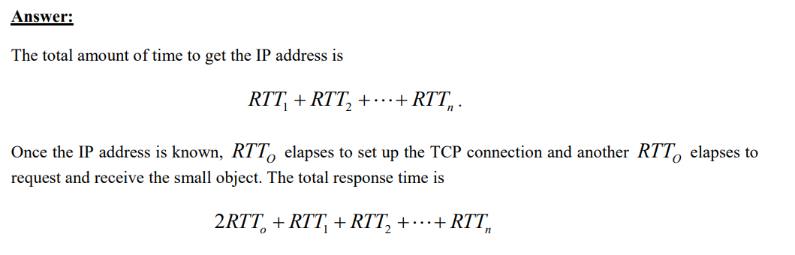
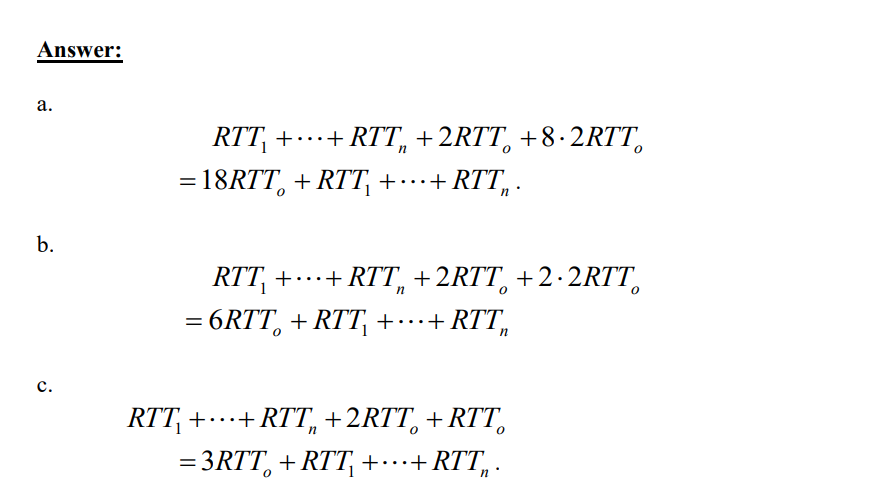
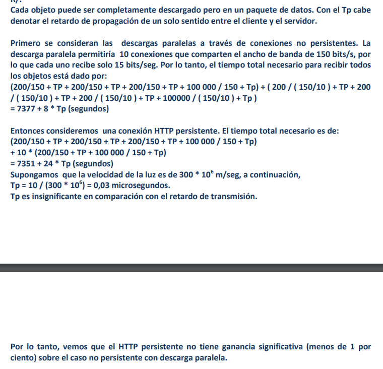
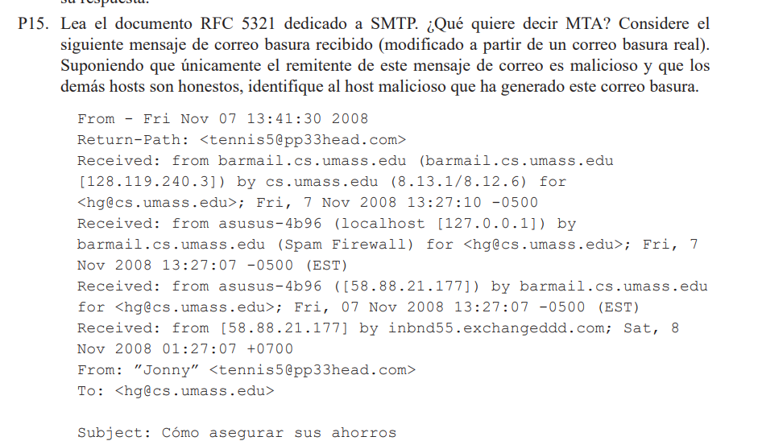
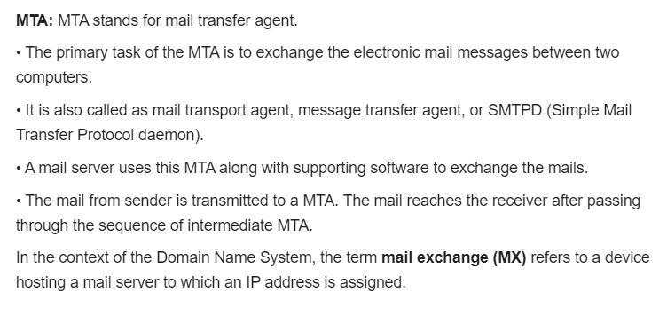
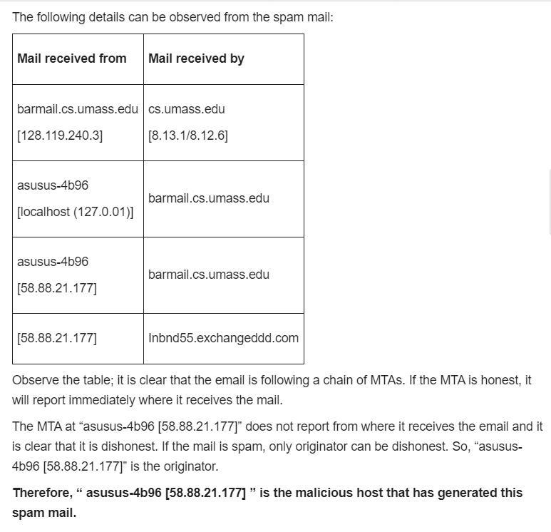

# Chapter 2
## Problem set answers

### P1. ¿Verdadero o falso?**

a. Un usuario solicita una página web que consta de texto y tres imágenes. Para obtener esa página, el cliente envía un mensaje de solicitud y recibe cuatro mensajes de respuesta.

**Answer:**
False.
There are four connections since each connection transports exactly one request message and one response message. So, each object will have its one request message instead of there being only one request message.

b. Dos páginas web diferentes (por ejemplo, www.mit.edu/research.html y www.mit. edu/students.html) se pueden enviar a través de la misma conexión persistente.

**Answer:**
True.
It is because both of these web pages are on the same physical server (www.mit.edu).

c. Con las conexiones no persistentes entre un navegador y un servidor de origen, un único segmento TCP puede transportar dos mensajes de solicitud HTTP distintos.

**Answer:**
False.
In a nonpersistent connection, the connection closes after each connection. In this case, the connection will close once the first message is received, and there will be a new connection opened to send the second message.

d. La línea de cabecera Date: del mensaje de respuesta HTTP indica cuándo el objeto fue modificado por última vez.

**Answer:**
False.
The “Date:” is the time at which the request was created and not when the object was last modified.

e. Los mensajes de respuesta HTTP nunca incluyen un cuerpo de mensaje vacío.

**Answer:**
False.
Some HTTP response messages have an empty message body. For example, HTTP Status-Code of 204 and 304 MUST NOT include a message body. (RFC 2616)

### P2.
SMS, iMessage y WhatsApp son todos ellos sistemas de mensajería en tiempo real para smartphone. Después de llevar a cabo una pequeña investigación en Internet, escriba un párrafo indicando los protocolos que cada uno de estos sistemas emplea. A continuación, escriba un párrafo explicando en qué se diferencian.

#### Answer
SMS es un protocolo de comunicación utilizado para enviar mensajes de texto en teléfonos móviles. Es un sistema de almacenamiento y reenvío, lo que significa que los mensajes se almacenan en una red antes de ser entregados al destinatario previsto. El protocolo SMS utiliza un formato específico para mensajes de texto y está limitado a 140 bytes/160 caracteres por mensaje. iMessage es un sistema de mensajería en tiempo real exclusivo para dispositivos Apple, como iPhone y iPad. Utiliza Internet para enviar mensajes, en lugar del protocolo tradicional de SMS. iMessage admite mensajes de texto, así como archivos multimedia como imágenes, vídeos y mensajes de audio. El protocolo iMessage está diseñado para brindar una experiencia de mensajería mejorada en comparación con los SMS, con tiempos de entrega más rápidos y la capacidad de enviar mensajes a través de Wi-Fi, en lugar de solo datos móviles. WhatsApp es un sistema de mensajería multiplataforma en tiempo real que utiliza Internet para comunicarse. Admite mensajes de texto, así como archivos multimedia como imágenes, vídeos, mensajes de audio y llamadas de voz. WhatsApp utiliza un protocolo propietario para proteger los mensajes entre dispositivos, garantizando que solo el destinatario previsto pueda acceder a la información. La principal diferencia entre estos tres sistemas de mensajería es su método de comunicación. Los SMS utilizan la red tradicional de telefonía móvil, mientras que iMessage y WhatsApp utilizan Internet. iMessage es exclusivo para dispositivos Apple, mientras que WhatsApp es multiplataforma y puede usarse en múltiples sistemas operativos, incluidos iOS, Android y Windows. Además, iMessage y WhatsApp ofrecen más funciones y mayor seguridad en comparación con los SMS, lo que los convierte en una opción más atractiva para la comunicación personal y empresarial.

---

Los SM utilizan el protocolo SMPP para enviar y recibir mensajes. Utiliza como protocolo TCP/IP de nivel 7. Cuando el mensaje tiene más de 160 caracteres, se divide en partes. IMessage solo se usa para dispositivos Apple. Se utiliza para enviar fotos, videos, etc. Es desde la notificación Push Button. Establece una conexión de mantenimiento de vida. WApp es un mensaje de texto popular que utiliza el protocolo XMPP que tiene XML como lenguaje. La diferencia entre estos sistemas es que los SMS no están cifrados y luego Whats App e iMessage sí están cifrados. Los SM solo se pueden usar para enviar texto e imágenes, mientras que Whats App y I Message se pueden usar para enviar videos y más. SMS y Whats App pueden estar en cualquier dispositivo, mientras que iMessage es solo para dispositivos Apple.

---

**P2. Protocolos utilizados por SMS, iMessage y WhatsApp:**

- **SMS (Short Message Service):** Utiliza el protocolo de señalización SS7 (Signaling System No. 7) para enviar mensajes de texto entre dispositivos móviles. Estos mensajes son limitados en longitud y se envían a través de la red de telefonía móvil.

- **iMessage:** Desarrollado por Apple, iMessage utiliza un protocolo propio basado en el estándar XMPP (Extensible Messaging and Presence Protocol) para la mensajería instantánea. Además, iMessage puede usar la tecnología de encriptación end-to-end para garantizar la seguridad y privacidad de los mensajes.

- **WhatsApp:** WhatsApp emplea un protocolo de mensajería propio llamado Protocolo de WhatsApp (WhatsApp Protocol), que utiliza una combinación de tecnologías como XMPP para la comunicación en tiempo real y una capa de encriptación basada en el protocolo Signal para asegurar la confidencialidad de los mensajes.

**Diferencias entre SMS, iMessage y WhatsApp:**

La principal diferencia radica en los protocolos y las tecnologías subyacentes que utilizan estos sistemas de mensajería en tiempo real. Mientras que SMS se basa en el protocolo SS7 y está limitado en funcionalidades y seguridad, iMessage y WhatsApp emplean protocolos más avanzados como XMPP y Signal, respectivamente, que permiten características adicionales como el envío de multimedia, mensajes encriptados y la integración con otros servicios y plataformas. Además, iMessage está específicamente diseñado para dispositivos Apple, mientras que WhatsApp es multiplataforma y está disponible para una amplia gama de dispositivos móviles.

### P3
Un cliente HTTP desea recuperar un documento web que se encuentra en un URL dado. Inicialmente, la dirección IP del servidor HTTP es desconocida. ¿Qué protocolos de la capa de aplicación y de la capa de transporte además de HTTP son necesarios en este escenario?

### Answer 


HTTP is an application layer protocol. HTTP needs TCP as its transport layer protocol.
To establish a TCP connection, socket address of the server is needed. To perform this , another application layer protocol is needed.

This application layer protocol is DNS. DNS stands for Domain Name System. DNS uses UDP as its transport layer protocol.

DNS is used to map url to IP address.

Using DNS, client will get the IP address of the server. As HTTP is a standard application layer protocol, it has well known port number which is 80. This IP address + port number forms the socket address of the server.
Now TCP connection will be established and HTTP request message will be send to server. Then server will respond with the web document.

Thus except HTTP, application layer protocol used is DNS. Transport layer protocols used are TCP and UDP.

---

Transport layer: This requires UDP for domain name service (DNS) and TCP for the hypertext transport protocol(HTTP)

Application layer: This requires DNS and HTTP services. 

An application layer protocol is HTTP which requires TCP must be used as the transport layer protocol for HTTP.

The socket address of the server is required in order to create a TCP connection and another application layer protocol is required for this to be accomplished.  

#### P4
La siguiente cadena de caracteres ASCII ha sido capturada por Wireshark cuando el navegador enviaba un mensaje GET HTTP (es decir, este es el contenido real de un mensaje GET HTTP). Los caracteres <cr><lf> representan el retorno de carro y el salto de línea (es decir, la cadena de caracteres en cursiva <cr> del texto que sigue a este párrafo representa el carácter de retorno de carro contenido en dicho punto de la cabecera HTTP). Responda a las siguientes cuestiones, indicando en qué parte del siguiente mensaje GET HTTP se encuentra la respuesta.
```
GET /cs453/index.html HTTP/1.1<cr><lf>Host: gai
a.cs.umass.edu<cr><lf>User-Agent: Mozilla/5.0 (
Windows;U; Windows NT 5.1; en-US; rv:1.7.2) Gec
ko/20040804 Netscape/7.2 (ax) <cr><lf>Accept:ex
t/xml, application/xml, application/xhtml+xml, text
/html;q=0.9, text/plain;q=0.8,image/png,*/*;q=0.5
<cr><lf>Accept-Language: en-us,en;q=0.5<cr><lf>Accept-
Encoding: zip,deflate<cr><lf>Accept-Charset: ISO
-8859-1,utf-8;q=0.7,*;q=0.7<cr><lf>Keep-Alive: 300<cr>
<lf>Connection:keep-alive<cr><lf><cr><lf>
```
a.The document request was http://gaia.cs.umass.edu/cs453/index.html. The Host : field indicates the server's name and /cs453/index.html indicates the file name.

b) The browser is running HTTP version 1.1, as indicated just before the first pair.

c) The browser is requesting a persistent connection, as indicated by the Connection: keep-alive.

d) This is a trick question. This information is not contained in an HTTP message anywhere. So there is no way to tell this from looking at the exchange of HTTP messages alone. One would need information from the IP datagrams (that carried the TCP segment that carried the HTTP GET request) to answer this question.

e) Mozilla/5.0. The browser type information is needed by the server to send different versions of the same object to different types of browsers.

#### P5

El siguiente texto muestra la respuesta devuelta por el servidor al mensaje de solicitud GET HTTP del problema anterior. Responda a las siguientes cuestiones, indicando en qué parte del siguiente mensaje se encuentran las respuestas.

```
HTTP/1.1 200 OK<cr><lf>Date: Tue, 07 Mar 2008
12:39:45GMT<cr><lf>Server: Apache/2.0.52 (Fedora)
<cr><lf>Last-Modified: Sat, 10 Dec2005 18:27:46 GMT<cr><lf>ETag:
”526c3-f22-a88a4c80”<cr><lf>Accept-
Ranges: bytes<cr><lf>Content-Length: 3874<cr><lf>
Keep-Alive: timeout=max=100<cr><lf>Connection:
Keep-Alive<cr><lf>Content-Type: text/html; charset=
ISO-8859-1<cr><lf><cr><lf><!doctype html public ”-
//w3c//dtd html 4.0transitional//en”><lf><html><lf> <head><lf>
<meta http-equiv=”Content-Type”
content=”text/html; charset=iso-8859-1”><lf> <meta
name=”GENERATOR” content=”Mozilla/4.79 [en] (Windows NT
5.0; U) Netscape]”><lf> <title>CMPSCI 453 / 591 /
NTU-ST550ASpring 2005 homepage</title><lf></head><lf>
<aquí continúa el texto del documento (no mostrado)>
```
a. Was the server able to successfully find the document or not? What time was the document reply provided? Yes, the server was able to successfully find the document. We can tell this from the line “HTTP/1.1 200 OK”. The document reply was provided on Tue, 07 Mar 2008 12:39:45 GMT.
b. When was the document last modified? The document was last modified on Saturday, December 10th, 2005. This comes from the line “Last-Modified: Sat, 10 Dec2005 18:27:46 GMT”.
c. How many bytes are there in the document being returned? There are 3874 bytes being returned.  This comes from the line “Content-Length:3874”.                                            d. What are the first 5 bytes of the document being returned? Did the server agree to a persistent connection? The first five bytes are <!doc (there’s five characters, so five bytes).  The server did agree to a persistent connection, since the line “Connection: Keep-Alive” indicates a keep alive connection, which is a persistent connection.

### P7
Suponga que en su navegador hace clic en un vínculo a una página web. La dirección IP correspondiente al URL asociado no está almacenado en la caché de su host local, por lo que es necesario realizar una búsqueda DNS para obtener la dirección IP. Suponga que antes de que su host reciba la dirección IP de DNS se han visitado n servidores DNS y que los tiempos  de ida y vuelta (RTT) de las sucesivas visitas son RTT1, . . ., RTTn. Suponga además que la página web asociada con el vínculo contiene exactamente un objeto, que consta de un pequeño fragmento de texto HTML. Sea RTT0 el tiempo RTT entre el host local y el servidor que contiene el objeto. Suponiendo un tiempo de transmisión de cero para el objeto, ¿cuánto tiempo  transcurre desde que el cliente hace clic en el vínculo hasta que recibe el objeto?

### Solution


### P8



### P10


### P11
Continuando con el escenario del problema anterior, suponga que Benito comparte el enlace  con otros cuatro usuarios. Benito utiliza instancias paralelas de HTTP no persistente y los 
otros cuatro usuarios utilizan HTTP no persistente sin descargas en paralelo. a. ¿Le ayudan a Benito las conexiones en paralelo a obtener las páginas más rápidamente? ¿Por qué?
b. Si los cinco usuarios abren cinco instancias paralelas de HTTP no persistente, ¿seguirán siendo beneficiosas las conexiones en paralelo de Benito? ¿Por qué?

### Solution
R/.
Sí, porque Benito tiene más conexiones, y así pueda obtener proporcionalmente más ancho de banda de la cuota del ancho de banda total del enlace.

R/.
Sí, Benito aún necesita realizar descargas en paralelo, de lo contrario va a recibir menos cuota
de ancho de banda que otros cuatro usuarios. De hecho, todos los usuarios podrían tender a abrir más conexiones con el fin de ganar más cuota de ancho de banda.

### P13
What is the difference between MAIL FROM: in SMTP and From: in the email message itself?

### Solution
La MAIL FROM: en SMTP es un mensaje desde el cliente SMTP que identifica al remitente del
mail a servidor SMTP. “El De:” en el mensaje de correo no es un mensajes SMTP, sino más bien
es sólo una línea en el cuerpo del mensaje de correo.

### P14. 
¿Cómo marca SMTP el final del cuerpo de un mensaje? ¿Cómo lo hace HTTP? ¿Puede HTTP utilizar el mismo método que SMTP para marcar el final del cuerpo de un mensaje? Explique su respuesta.

### Solution

SMTP uses a line containing only a period ”.” to mark the end of a message body. HTTP uses “Content-Length header field” to indicate the length of a message body.No, HTTP cannot use the method used by SMTP, because HTTP message could be binary data, whereas in SMTP, the message body must be in 7 bit ASCII format.

### P15


### Solution




### P16
Lea el documento RFC 1939 dedicado a POP3. ¿Cuál es el propósito del comando UIDL POP3?